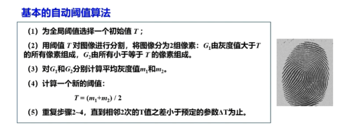
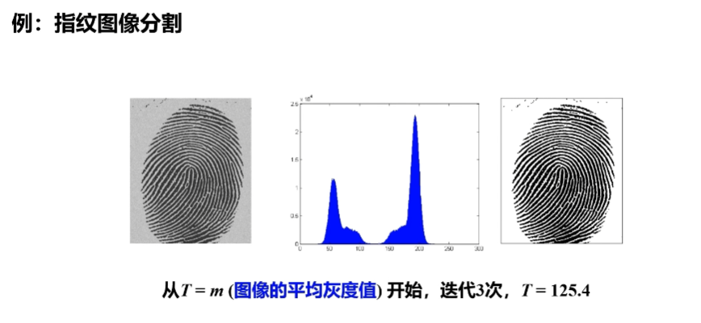

图像分割是一个经典的图像处理问题，是图像理解和识别的基础，在模式识别、计算机视觉、医学图像处理等领域中有着广泛的应用。其主要目的是将感兴趣目标从复杂背景中提取出来，以便进行目标识别和分析。

# 阈值分割
阈值分割技术是一种非常重要的图像分割技术，它以其简单、有效、便于理解的特性而得到了广泛的研究与应用。

## 图像二值化
当背景和前景的灰度分布差异很明显时，可以用单个阈值处理图像。  
在大多数应用中，通常图像之间存在较大的变化，即使可以使用全局阈值党法，也需要对每幅图像自动估计出一个合适的阈值。

>*当物体和背景的直方图之间存在一个相当清晰的波谷时，表明这个简单的算法工作的很好

### Otsu最佳阈值处理（最大类间差方法）
Otsu算法，也叫**最大类间方差法**，是1979年由日本学者大津提出的（所以也叫大津法），是一种自适应阈值确定的方法，是一种全局的二值化算法。  
它是根据图像的灰度特性，将图像分为前景和背景两个部分。当取最佳阈值时，两部分的差距是最大的；在此算法中，衡量差别的标准最常见的是最大类间方差 。

 #### 算法描述
假设一幅尺寸为$M*N$的图像中有L个不同的灰度等级$\{0,1,2,...,L-1\}$  
$n_i$ 表示灰度级为i的像素个数  
$p_i$ 表示归一化的直方图的分量  
$$p_i = \frac{n_i}{MN},\sum^{L-1}_{i=0}p_i = 1$$  
选择一个阈值$T(k) = k (0<k<L-1)$，用它把图像阈值化为两类：
- $C_1$(灰度值在区间$[0,k]$)
- $C_2$(灰度值在区间$[K+1,L-1]$)

1. **类$C_1$(灰度值在区间$[0,k]$)**  
像素被分配到$C_1$的概率为$P_1(k)$：
$$P_1(k) = \sum^{k}_{i=0}P_i$$
分配到$C_1$的像素平均灰度值：
$$\begin{align}m_1(k) &= \sum^{k}_{i=0}{iP(i|C_1)} \\
        &= \sum^{k}_{i=0}{iP(C_1|i)P(i)/P(C_1)} \\
        &= \frac{1}{P_1(k)}\sum^{k}_{i=0}{ip_i}\end{align}$$

2. **类$C_2$(灰度值在区间$[k+1,L-1]$)**  
$C_2$发生的概率为$P_2(k)$
$$P_2(k) = \sum^{L-1}_{i=k+1}p_i = 1 - P_1(k)$$
分配到$C_2$的像素平均灰度值：
$$\begin{align}
    m_2(k) &= \sum^{L-1}_{i=k+1}{iP(i|C_2)} \\
    &= \frac{1}{P_2(k)}\sum^{L-1}_{i=k+1}{iP_i}
\end{align}$$

**灰度级k的累加均值为：$m(k)=\sum^{k}_{i=0}{ip_i}$**  

**整幅图像的平均灰度为：$m_G = \sum^{L-1}_{i=0}{ip_i}$**

3.**类间方差**  
**全局方差：**：
$$\sigma^2_G = \sum^{L-1}_{i=0}(i-m_G)^2P_i$$
**类间方差：**
$$\sigma^2_B = P_1(m_1-m_G)^2+P_2(m_2-m_G)^2$$
此外，类间方差还可以写为：
$$\begin{align}
    \sigma^2_B=P_1P_2(m_1-m_2)^2 \\
    =\frac{(m_GP_1-m)^2}{P_1(1-P_1)}
\end{align}$$